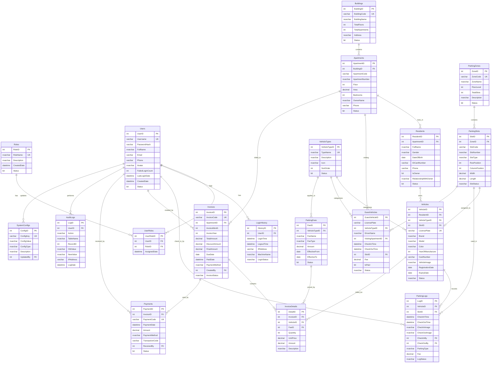

# 📊 DATABASE DIAGRAM - HỆ THỐNG QUẢN LÝ BÃI ĐẬU XE Ô TÔ CHUNG CƯ

## 🗂️ Tổng Quan Database

**Database Name**: `ParkingManagement`  
**Collation**: `Vietnamese_CI_AS`  
**Số lượng bảng**: 19 bảng  
**Engine**: SQL Server 2019+

---

## 📐 Entity Relationship Diagram (ERD)



---

## 🔗 Chi Tiết Quan Hệ Giữa Các Bảng

### 1. Module Quản Lý Người Dùng

```
┌──────────────┐       ┌──────────────┐       ┌──────────────┐
│    Roles     │◄──────│  UserRoles   │──────►│    Users     │
│              │  1:N  │              │  N:1  │              │
│  - RoleID    │       │  - UserRoleID│       │  - UserID    │
│  - RoleName  │       │  - UserID FK │       │  - Username  │
│              │       │  - RoleID FK │       │  - Password  │
└──────────────┘       └──────────────┘       └──────┬───────┘
                                                     │ 1:N
                                                     ▼
                                              ┌──────────────┐
                                              │ LoginHistory │
                                              │              │
                                              │  - HistoryID │
                                              │  - UserID FK │
                                              │  - LoginTime │
                                              └──────────────┘
```

### 2. Module Căn Hộ & Cư Dân

```
┌──────────────┐       ┌──────────────┐       ┌──────────────┐
│  Buildings   │──────►│  Apartments  │──────►│  Residents   │
│              │  1:N  │              │  1:N  │              │
│  - BuildingID│       │  - ApartmentID       │  - ResidentID│
│  - BuildingNa│       │  - BuildingID FK     │  - ApartmentID FK
│  - TotalFloor│       │  - ApartmentNo       │  - FullName  │
│              │       │  - Floor     │       │  - IsOwner   │
└──────────────┘       └──────────────┘       └──────────────┘
```

### 3. Module Quản Lý Xe

```
┌──────────────┐       ┌──────────────┐       ┌──────────────┐
│ VehicleTypes │──────►│   Vehicles   │◄──────│  Residents   │
│              │  1:N  │              │  N:1  │              │
│  - TypeID    │       │  - VehicleID │       │  - ResidentID│
│  - TypeName  │       │  - TypeID FK │       │              │
│              │       │  - ResidentID│       │              │
└──────────────┘       │  - SlotID FK │       └──────────────┘
                       │  - LicensePla│
                       └──────┬───────┘
                              │ N:1
                              ▼
                       ┌──────────────┐       ┌──────────────┐
                       │ ParkingSlots │◄──────│ ParkingZones │
                       │              │  N:1  │              │
                       │  - SlotID    │       │  - ZoneID    │
                       │  - ZoneID FK │       │  - ZoneName  │
                       │  - SlotCode  │       │  - FloorLevel│
                       │  - SlotStatus│       │              │
                       └──────────────┘       └──────────────┘
```

### 4. Module Ra/Vào & Lịch Sử

```
┌──────────────┐       ┌──────────────┐       ┌──────────────┐
│   Vehicles   │──────►│ ParkingLogs  │◄──────│ ParkingSlots │
│              │  1:N  │              │  N:1  │              │
│  - VehicleID │       │  - LogID     │       │  - SlotID    │
│              │       │  - VehicleID │       │              │
│              │       │  - SlotID FK │       │              │
│              │       │  - CheckInTim│       │              │
│              │       │  - CheckOutTi│       │              │
└──────────────┘       │  - CheckInBy │       └──────────────┘
                       │  - LogStatus │
                       └──────┬───────┘
                              │ N:1
                              ▼
                       ┌──────────────┐
                       │    Users     │
                       │              │
                       │  CheckInBy   │
                       │  CheckOutBy  │
                       └──────────────┘
```

### 5. Module Thanh Toán & Hóa Đơn

```
┌──────────────┐       ┌──────────────┐       ┌──────────────┐
│  Apartments  │──────►│   Invoices   │──────►│InvoiceDetails│
│              │  1:N  │              │  1:N  │              │
│  - ApartmentI│       │  - InvoiceID │       │  - DetailID  │
│              │       │  - ApartmentI│       │  - InvoiceID │
│              │       │  - InvoiceCod│       │  - VehicleID │
│              │       │  - TotalAmoun│       │  - FeeID FK  │
│              │       │  - InvoiceSta│       │  - Amount    │
│              │       └──────┬───────┘       └──────────────┘
│              │              │ 1:N                  ▲
└──────────────┘              ▼                      │
                       ┌──────────────┐       ┌──────────────┐
                       │   Payments   │       │ ParkingFees  │
                       │              │       │              │
                       │  - PaymentID │       │  - FeeID     │
                       │  - InvoiceID │       │  - FeeName   │
                       │  - Amount    │       │  - FeeType   │
                       │  - PaymentMet│       │  - Amount    │
                       └──────────────┘       └──────────────┘
```

---

## 📋 Danh Sách Các Bảng

| STT | Tên Bảng | Mô Tả | Số Cột |
|-----|----------|-------|--------|
| 1 | `Roles` | Vai trò người dùng (Admin, Manager, Security, Cashier) | 5 |
| 2 | `Users` | Thông tin tài khoản người dùng hệ thống | 11 |
| 3 | `UserRoles` | Bảng liên kết nhiều-nhiều giữa User và Role | 4 |
| 4 | `LoginHistory` | Lịch sử đăng nhập/đăng xuất của user | 7 |
| 5 | `Buildings` | Thông tin các tòa nhà trong chung cư | 9 |
| 6 | `Apartments` | Thông tin căn hộ thuộc tòa nhà | 12 |
| 7 | `Residents` | Thông tin cư dân sống trong căn hộ | 13 |
| 8 | `VehicleTypes` | Loại phương tiện (ô tô 4 chỗ, 7 chỗ, SUV...) | 5 |
| 9 | `Vehicles` | Thông tin xe đăng ký của cư dân | 17 |
| 10 | `ParkingZones` | Khu vực đậu xe (tầng hầm B1, B2...) | 8 |
| 11 | `ParkingSlots` | Các ô đậu xe trong từng khu vực | 12 |
| 12 | `ParkingLogs` | Lịch sử ra/vào của xe | 13 |
| 13 | `GuestVehicles` | Quản lý xe khách vãng lai | 16 |
| 14 | `ParkingFees` | Bảng giá phí gửi xe | 10 |
| 15 | `Invoices` | Hóa đơn thu phí theo tháng | 15 |
| 16 | `InvoiceDetails` | Chi tiết hóa đơn (từng xe) | 8 |
| 17 | `Payments` | Lịch sử thanh toán hóa đơn | 10 |
| 18 | `AuditLogs` | Nhật ký hoạt động hệ thống | 10 |
| 19 | `SystemConfigs` | Cấu hình hệ thống | 6 |

---

## 🔑 Primary Keys & Foreign Keys

### Primary Keys (PK)
| Bảng | Cột PK | Kiểu | Auto Increment |
|------|--------|------|----------------|
| Roles | RoleID | INT | ✅ |
| Users | UserID | INT | ✅ |
| UserRoles | UserRoleID | INT | ✅ |
| Buildings | BuildingID | INT | ✅ |
| Apartments | ApartmentID | INT | ✅ |
| Residents | ResidentID | INT | ✅ |
| VehicleTypes | VehicleTypeID | INT | ✅ |
| Vehicles | VehicleID | INT | ✅ |
| ParkingZones | ZoneID | INT | ✅ |
| ParkingSlots | SlotID | INT | ✅ |
| ParkingLogs | LogID | INT | ✅ |
| ParkingFees | FeeID | INT | ✅ |
| Invoices | InvoiceID | INT | ✅ |
| InvoiceDetails | DetailID | INT | ✅ |
| Payments | PaymentID | INT | ✅ |
| GuestVehicles | GuestVehicleID | INT | ✅ |
| AuditLogs | LogID | INT | ✅ |
| SystemConfigs | ConfigID | INT | ✅ |
| LoginHistory | HistoryID | INT | ✅ |

### Foreign Keys (FK)
| Bảng | Cột FK | Tham chiếu | On Delete | On Update |
|------|--------|------------|-----------|-----------|
| UserRoles | UserID | Users(UserID) | NO ACTION | CASCADE |
| UserRoles | RoleID | Roles(RoleID) | NO ACTION | CASCADE |
| Apartments | BuildingID | Buildings(BuildingID) | NO ACTION | CASCADE |
| Residents | ApartmentID | Apartments(ApartmentID) | NO ACTION | CASCADE |
| Vehicles | ResidentID | Residents(ResidentID) | NO ACTION | CASCADE |
| Vehicles | VehicleTypeID | VehicleTypes(VehicleTypeID) | NO ACTION | CASCADE |
| Vehicles | SlotID | ParkingSlots(SlotID) | SET NULL | CASCADE |
| ParkingSlots | ZoneID | ParkingZones(ZoneID) | NO ACTION | CASCADE |
| ParkingLogs | VehicleID | Vehicles(VehicleID) | NO ACTION | CASCADE |
| ParkingLogs | SlotID | ParkingSlots(SlotID) | SET NULL | CASCADE |
| ParkingLogs | CheckInBy | Users(UserID) | NO ACTION | CASCADE |
| ParkingLogs | CheckOutBy | Users(UserID) | NO ACTION | CASCADE |
| ParkingFees | VehicleTypeID | VehicleTypes(VehicleTypeID) | NO ACTION | CASCADE |
| Invoices | ApartmentID | Apartments(ApartmentID) | NO ACTION | CASCADE |
| Invoices | CreatedBy | Users(UserID) | NO ACTION | CASCADE |
| InvoiceDetails | InvoiceID | Invoices(InvoiceID) | CASCADE | CASCADE |
| InvoiceDetails | VehicleID | Vehicles(VehicleID) | NO ACTION | CASCADE |
| InvoiceDetails | FeeID | ParkingFees(FeeID) | NO ACTION | CASCADE |
| Payments | InvoiceID | Invoices(InvoiceID) | NO ACTION | CASCADE |
| Payments | ReceivedBy | Users(UserID) | NO ACTION | CASCADE |
| GuestVehicles | VehicleTypeID | VehicleTypes(VehicleTypeID) | NO ACTION | CASCADE |
| GuestVehicles | VisitingApartmentID | Apartments(ApartmentID) | SET NULL | CASCADE |
| GuestVehicles | SlotID | ParkingSlots(SlotID) | SET NULL | CASCADE |
| AuditLogs | UserID | Users(UserID) | SET NULL | CASCADE |
| SystemConfigs | UpdatedBy | Users(UserID) | SET NULL | CASCADE |
| LoginHistory | UserID | Users(UserID) | NO ACTION | CASCADE |

---

## 📊 Indexes

| Bảng | Index Name | Cột | Loại |
|------|------------|-----|------|
| Vehicles | IX_Vehicles_LicensePlate | LicensePlate | Non-Clustered |
| Vehicles | IX_Vehicles_CardNumber | CardNumber | Non-Clustered |
| ParkingLogs | IX_ParkingLogs_CheckInTime | CheckInTime | Non-Clustered |
| ParkingLogs | IX_ParkingLogs_VehicleID | VehicleID | Non-Clustered |
| Invoices | IX_Invoices_InvoiceCode | InvoiceCode | Non-Clustered |
| Invoices | IX_Invoices_ApartmentID | ApartmentID | Non-Clustered |
| Apartments | IX_Apartments_BuildingID | BuildingID | Non-Clustered |
| Residents | IX_Residents_ApartmentID | ApartmentID | Non-Clustered |

---

## ⚡ Stored Procedures

| STT | Tên SP | Mô Tả | Parameters |
|-----|--------|-------|------------|
| 1 | `sp_Login` | Xác thực đăng nhập | @Username, @Password |
| 2 | `sp_CheckIn` | Check-in xe vào bãi | @VehicleID, @SlotID, @CheckInBy, @CheckInImage |
| 3 | `sp_CheckOut` | Check-out xe ra khỏi bãi | @LogID, @CheckOutBy, @CheckOutImage |
| 4 | `sp_GetDashboardStats` | Lấy thống kê cho Dashboard | (không có) |
| 5 | `sp_SearchVehicle` | Tìm kiếm xe theo biển số/thẻ | @SearchText |

---

## 🎨 Visual Database Schema

```
╔═══════════════════════════════════════════════════════════════════════════════╗
║                        PARKING MANAGEMENT DATABASE                             ║
╠═══════════════════════════════════════════════════════════════════════════════╣
║                                                                               ║
║  ┌─────────────────────────────────────────────────────────────────────────┐  ║
║  │                        USER MANAGEMENT MODULE                           │  ║
║  │  ┌─────────┐     ┌───────────┐     ┌─────────┐     ┌──────────────┐    │  ║
║  │  │  Roles  │◄───►│ UserRoles │◄───►│  Users  │────►│ LoginHistory │    │  ║
║  │  └─────────┘     └───────────┘     └────┬────┘     └──────────────┘    │  ║
║  └─────────────────────────────────────────┼───────────────────────────────┘  ║
║                                            │                                  ║
║  ┌─────────────────────────────────────────┼───────────────────────────────┐  ║
║  │                     APARTMENT & RESIDENT MODULE                         │  ║
║  │  ┌───────────┐     ┌────────────┐     ┌─┴─────────┐                     │  ║
║  │  │ Buildings │────►│ Apartments │────►│ Residents │                     │  ║
║  │  └───────────┘     └─────┬──────┘     └─────┬─────┘                     │  ║
║  └──────────────────────────┼──────────────────┼───────────────────────────┘  ║
║                             │                  │                              ║
║  ┌──────────────────────────┼──────────────────┼───────────────────────────┐  ║
║  │                      VEHICLE MODULE         │                           │  ║
║  │  ┌──────────────┐     ┌─┴────────────┐     │                            │  ║
║  │  │ VehicleTypes │────►│   Vehicles   │◄────┘                            │  ║
║  │  └──────┬───────┘     └──────┬───────┘                                  │  ║
║  └─────────┼────────────────────┼──────────────────────────────────────────┘  ║
║            │                    │                                             ║
║  ┌─────────┼────────────────────┼──────────────────────────────────────────┐  ║
║  │         │    PARKING SLOT MODULE                                        │  ║
║  │         │     ┌──────────────┐     ┌──────────────┐                     │  ║
║  │         │     │ ParkingZones │────►│ ParkingSlots │◄────────────────┐   │  ║
║  │         │     └──────────────┘     └──────┬───────┘                 │   │  ║
║  └─────────┼─────────────────────────────────┼─────────────────────────┼───┘  ║
║            │                                 │                         │      ║
║  ┌─────────┼─────────────────────────────────┼─────────────────────────┼───┐  ║
║  │         │         PARKING LOG MODULE      │                         │   │  ║
║  │         │     ┌───────────────┐     ┌─────┴──────┐                  │   │  ║
║  │         └────►│ GuestVehicles │     │ ParkingLogs│◄─────────────────┘   │  ║
║  │               └───────────────┘     └────────────┘                      │  ║
║  └─────────────────────────────────────────────────────────────────────────┘  ║
║                                                                               ║
║  ┌─────────────────────────────────────────────────────────────────────────┐  ║
║  │                        BILLING & PAYMENT MODULE                         │  ║
║  │  ┌─────────────┐     ┌──────────┐     ┌────────────────┐               │  ║
║  │  │ ParkingFees │────►│ Invoices │────►│ InvoiceDetails │               │  ║
║  │  └─────────────┘     └────┬─────┘     └────────────────┘               │  ║
║  │                           │                                             │  ║
║  │                      ┌────┴─────┐                                       │  ║
║  │                      │ Payments │                                       │  ║
║  │                      └──────────┘                                       │  ║
║  └─────────────────────────────────────────────────────────────────────────┘  ║
║                                                                               ║
║  ┌─────────────────────────────────────────────────────────────────────────┐  ║
║  │                           SYSTEM MODULE                                 │  ║
║  │  ┌────────────┐                    ┌───────────────┐                    │  ║
║  │  │ AuditLogs  │                    │ SystemConfigs │                    │  ║
║  │  └────────────┘                    └───────────────┘                    │  ║
║  └─────────────────────────────────────────────────────────────────────────┘  ║
║                                                                               ║
╚═══════════════════════════════════════════════════════════════════════════════╝
```

---

## 📝 Ghi Chú

> [!NOTE]
> - Tất cả các bảng đều có cột `CreatedDate` để tracking thời gian tạo
> - Sử dụng `NVARCHAR` cho các trường tiếng Việt
> - Password được lưu dạng hash (MD5/SHA256)
> - Các bảng chính đều có cột `Status` để soft delete

> [!TIP]
> - Sử dụng Stored Procedures cho các truy vấn phức tạp
> - Áp dụng Index cho các cột thường xuyên search/filter
> - Backup database định kỳ

---

*Tài liệu được tạo tự động - Cập nhật: 14/12/2024*
